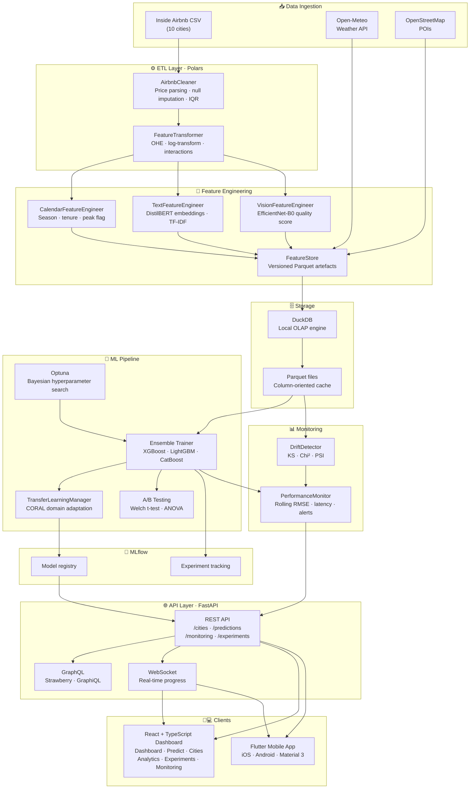

# Urban Intelligence Framework v2.0.0

# Project documentation — overview, architecture, quick start, and stack reference

# Urban Intelligence Framework v2.0.0

[](https://www.python.org/downloads/)
[](https://flutter.dev/)
[](https://react.dev/)
[](https://opensource.org/licenses/MIT)
[](https://github.com/astral-sh/ruff)

A production-grade, end-to-end machine learning platform for analysing and predicting Airbnb rental prices across multiple cities. Built with modern data engineering tools and designed for local deployment without cloud dependencies.

---

## 🎯 Project Overview

This framework solves the challenge of predicting nightly rental prices from raw Airbnb listing data. It covers the full lifecycle from raw CSV ingestion through ETL cleaning, feature engineering, ensemble model training, and real-time serving — exposed through both a React web dashboard and a Flutter mobile app.

### Key Features

- **Multi-city transfer learning** — CORAL domain adaptation across source cities to improve sparse-data targets
- **Ensemble ML models** — XGBoost + LightGBM + CatBoost with Optuna hyperparameter optimisation and weight blending
- **Transformer NLP** — DistilBERT-based listing text feature extraction with PCA compression
- **Computer vision** — EfficientNet-B0 photo quality scoring for listing images
- **GraphQL + REST APIs** — dual interface with FastAPI, Strawberry, and WebSocket real-time updates
- **A/B testing framework** — statistically rigorous experiment management (Welch's t-test / ANOVA)
- **Automated drift detection** — KS test, Chi², and PSI with rolling performance monitoring
- **React + TypeScript dashboard** — seven functional areas with Recharts data visualisation
- **Flutter mobile app** — Material 3 dark-themed iOS/Android companion app

---

## 🏗️ Architecture



---

## 📁 Project Structure

```
urban-intelligence/
├── docker-compose.yml          # Full-stack orchestration
├── Makefile                    # Convenience commands
├── .github/workflows/          # CI/CD pipelines (GitHub Actions)
│
├── backend/
│   ├── pyproject.toml          # UV environment configuration
│   ├── Dockerfile              # Multi-stage Python image
│   ├── .env.example            # Environment variable template
│   ├── src/
│   │   ├── config.py           # Centralised configuration (Pydantic Settings)
│   │   ├── database/           # DuckDB OLAP engine
│   │   ├── data/               # DataService (fetch-once/query-fast) + generator
│   │   ├── etl/                # Polars cleaner + feature transformer
│   │   ├── features/           # Feature store, calendar, NLP, vision
│   │   ├── modeling/           # Ensemble trainer, transfer learning, A/B testing
│   │   ├── monitoring/         # Drift detector, performance monitor + alerts
│   │   └── validation/         # 4-stage pipeline expectations
│   ├── api/
│   │   ├── main.py             # FastAPI application factory
│   │   ├── graphql_schema.py   # Strawberry GraphQL schema
│   │   ├── websocket.py        # Real-time progress + monitoring WebSocket
│   │   └── routers/            # cities · predictions · monitoring · experiments
│   ├── scripts/
│   │   ├── run_etl.py          # ETL pipeline CLI
│   │   ├── run_training.py     # Model training CLI
│   │   └── scheduled_retrain.py # Drift-triggered retraining
│   └── tests/                  # pytest API + unit tests
│
├── frontend/
│   ├── package.json            # Node dependencies (React 18, Vite, Tailwind)
│   ├── Dockerfile              # Node build → nginx runtime
│   └── src/
│       ├── api/                # Axios client + typed service functions
│       ├── components/         # Layout, UI primitives, Recharts wrappers
│       ├── hooks/              # React Query hooks + Zustand settings store
│       ├── pages/              # Dashboard · Predict · Cities · Analytics
│       │                       # Experiments · Monitoring · Settings
│       └── types/              # Shared TypeScript interfaces
│
└── mobile/
    ├── pubspec.yaml            # Flutter dependencies
    └── lib/
        ├── main.dart           # Entry point + GoRouter
        ├── models/             # City, Prediction, Monitoring data classes
        ├── services/           # HTTP API service + Riverpod providers
        ├── screens/            # Dashboard · Predict · Cities · Analytics
        │                       # Monitoring · Settings
        └── widgets/            # AppShell (bottom nav), shared UI widgets
```

---

## 🚀 Quick Start

### Prerequisites

- [Docker](https://docs.docker.com/get-docker/) & Docker Compose v2+
- [UV](https://github.com/astral-sh/uv) package manager (backend local dev)
- Node.js 20+ (frontend local dev)
- [Flutter 3.x](https://flutter.dev/docs/get-started/install) (mobile dev)

### Run everything with Docker

```bash
# Clone the repository
git clone https://github.com/your-org/urban-intelligence.git
cd urban-intelligence

# Start all services (backend, frontend, MLflow, Redis)
make up

# Tail logs
make logs
```

### Local development (without Docker)

```bash
# Install all dependencies
make install

# Backend only (FastAPI with hot-reload on :8000)
make backend

# Frontend only (Vite dev server on :5173)
make frontend

# MLflow tracking UI on :5001
make mlflow
```

### Run the ML pipeline

```bash
# 1. Fetch data and run ETL for all cities (downloads from Inside Airbnb)
make etl

# 2. Train ensemble models for all cities
make train

# 3. Train with transfer learning
cd backend && python scripts/run_training.py --transfer

# 4. Scheduled retrain check (run as cron job)
make retrain
```

### Mobile

```bash
cd mobile
flutter pub get

# Generate platform directories (first time only)
flutter create . --project-name urban_intelligence

# Run on connected device or emulator
flutter run
```

---

## 📊 Data Pipeline

### Phase I — Ingestion

The `DataService` implements a **fetch-once, query-fast** pattern. The first request for a city triggers a full download from the Inside Airbnb catalogue (10 cities included). Subsequent requests are served instantly from Parquet cache registered as DuckDB views.

| Issue                                 | Solution                                 |
| ------------------------------------- | ---------------------------------------- |
| Malformed price strings (`$1,234.56`) | Regex extraction with Polars expressions |
| Geographic outliers                   | Coordinate bounds validation             |
| High-null columns (>80%)              | Automatic column dropping                |
| Remaining nulls                       | Median / mode imputation by dtype        |

### Phase II — Feature Engineering

Features are engineered across four pipelines that run sequentially:

| Pipeline                  | Features Generated                                                           |
| ------------------------- | ---------------------------------------------------------------------------- |
| `FeatureTransformer`      | OHE categoricals, log-skewed numerics, distance-to-centre, interaction terms |
| `CalendarFeatureEngineer` | Host tenure, season, peak-tourism flag, weekend indicator                    |
| `TextFeatureEngineer`     | DistilBERT CLS embeddings (32-dim PCA) or TF-IDF keyword groups              |
| `VisionFeatureEngineer`   | EfficientNet-B0 quality score, brightness, photo count                       |

### Phase III — Model Training

Ensemble of three gradient boosting models with Optuna Bayesian optimisation:

| Model    | Hyperparameter space                        | CV folds |
| -------- | ------------------------------------------- | -------- |
| XGBoost  | depth, lr, subsample, colsample, α, λ       | 5        |
| LightGBM | depth, lr, num_leaves, subsample, colsample | 5        |
| CatBoost | depth, lr, l2_leaf_reg                      | 5        |

Final predictions are a weighted average, with weights optimised on a held-out validation split.

### Phase IV — Transfer Learning

When `--transfer` is enabled, the `TransferLearningManager` applies **CORAL** (Correlation Alignment) to align second-order feature statistics between source and target city distributions, then trains a blended base + fine-tuned model.

---

## 📈 Model Performance

Primary evaluation metric is RMSE on log-transformed prices:

$$RMSE = \sqrt{\frac{1}{n}\sum_{i=1}^{n}(\log(1+y_i) - \log(1+\hat{y}_i))^2}$$

Log transformation reduces the impact of price outliers and maps the target to a more Gaussian distribution.

### Expected benchmarks

| Metric            | Target  | Description                       |
| ----------------- | ------- | --------------------------------- |
| RMSE (log scale)  | < 0.30  | Primary optimisation target       |
| MAE               | < $18   | Mean absolute error on raw prices |
| R²                | > 0.78  | Variance explained                |
| Training time     | < 8 min | Per city, 50 Optuna trials        |
| Inference latency | < 50 ms | Single prediction, p95            |

---

## 🌐 Services

| Service  | URL                             | Description                  |
| -------- | ------------------------------- | ---------------------------- |
| REST API | <http://localhost:8000/docs>    | FastAPI with Swagger UI      |
| GraphQL  | <http://localhost:8000/graphql> | Strawberry GraphiQL          |
| Frontend | <http://localhost:5173>         | React + TypeScript dashboard |
| MLflow   | <http://localhost:5001>         | Experiment tracking UI       |
| Redis    | localhost:6379                  | Cache and message broker     |
| Metrics  | <http://localhost:8000/metrics> | Prometheus scrape endpoint   |

---

## 🛠️ Configuration

All settings are managed through environment variables prefixed `URBAN_` or a `.env` file. Copy `.env.example` to `.env` to get started:

```bash
cp backend/.env.example backend/.env
```

Key settings:

```ini
URBAN_MLFLOW_TRACKING_URI=http://localhost:5001
URBAN_REDIS_URL=redis://localhost:6379
URBAN_N_OPTUNA_TRIALS=50
URBAN_CV_FOLDS=5
URBAN_TRANSFER_LEARNING_ENABLED=true
URBAN_SOURCE_CITIES=london,paris,barcelona
URBAN_NLP_MODEL=distilbert-base-uncased
URBAN_CV_MODEL=efficientnet_b0
```

---

## 🧪 Testing

```bash
# Run all backend tests with coverage
make test

# API integration tests only
make test-api

# Model unit tests only
make test-models

# Flutter widget + model tests
cd mobile && flutter test
```

---

## 📦 Technology Stack

| Layer               | Technology                    | Purpose                                |
| ------------------- | ----------------------------- | -------------------------------------- |
| Data processing     | Polars 1.0+                   | High-performance DataFrame operations  |
| OLAP engine         | DuckDB 1.0+                   | Local analytical queries on Parquet    |
| ML models           | XGBoost · LightGBM · CatBoost | Gradient boosting ensemble             |
| Optimisation        | Optuna 3.6+                   | Bayesian hyperparameter search         |
| Experiment tracking | MLflow 2.15+                  | Model registry and artefact management |
| NLP                 | DistilBERT (HuggingFace)      | Listing text embeddings                |
| Computer vision     | EfficientNet-B0 (torchvision) | Photo quality scoring                  |
| REST API            | FastAPI 0.111+                | Async Python web framework             |
| GraphQL             | Strawberry 0.232+             | Type-safe GraphQL layer                |
| Caching             | Redis 7                       | Response cache and WebSocket broker    |
| Frontend framework  | React 18 + TypeScript         | Web dashboard                          |
| Frontend build      | Vite 5 + Tailwind CSS 3       | Development and production builds      |
| Charts              | Recharts 2                    | Data visualisation                     |
| State management    | TanStack Query + Zustand      | Server and client state                |
| Mobile framework    | Flutter 3.x (Dart)            | iOS and Android app                    |
| Mobile state        | Riverpod 2.x                  | Reactive state management              |
| Mobile charts       | fl_chart 0.67                 | Native chart rendering                 |
| Containerisation    | Docker + Docker Compose       | Service orchestration                  |
| CI/CD               | GitHub Actions                | Automated test and deploy              |
| Code quality        | Ruff + ESLint + flutter_lints | Linting and formatting                 |

---

## 📄 License

This project is licensed under the MIT License — see the [LICENSE](LICENSE) file for details.

## 🤝 Contributing

1. Fork the repository
2. Create a feature branch (`git checkout -b feature/amazing-feature`)
3. Commit your changes (`git commit -m 'Add amazing feature'`)
4. Push to the branch (`git push origin feature/amazing-feature`)
5. Open a Pull Request

---

**Built with ❤️ by Francisco Javier Mercader Martínez**
